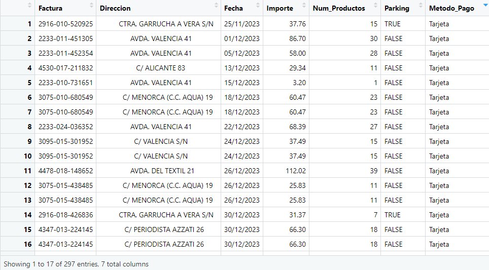
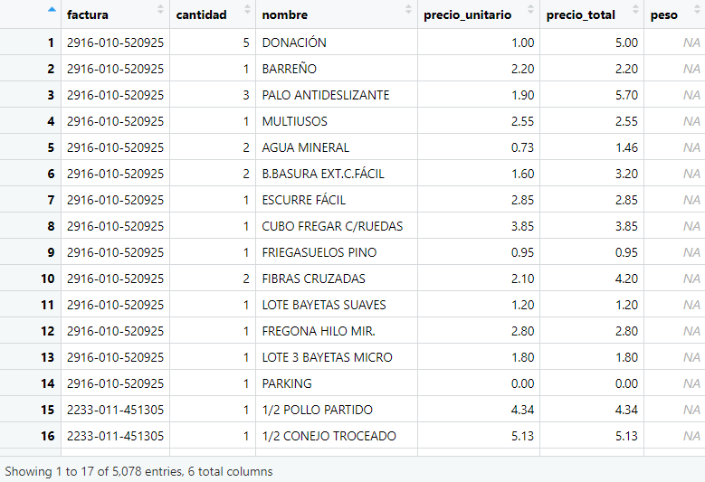

#Introducción.

En este proyecto de la asignatura Tratamiento de los Datos del Grado Ciencia de
Datos, se encomienda la tarea del estudio de los datos de uno de los 
supermercados líder en España: Mercadona.
Para ello, han sido proporcionados una gran cantidad de tickets que han 
permitido un buen estudio del comportamiento del mercado y de sus clientes.


#Gestión de los datos.

Para la realización del MiniProyecto, ha sido necesario llevar a cabo un
tratamiento previo de los tickets proporcionados, iniciando con su filtrado, 
ya que algunos de ellos no correspondían a Mercadona, sino a otros supermercados
que no son relevantes para nuestro  estudio.

A continuación, estos tickets han sido importados de un formato .pdf a un
formato más manejable tipo .txt y posteriormente han sido procesados con RStudio
y guardados en dos data frames para un correcto estudio de la información 
obtenida.

En el primer data frame, se ha guardado la información de cada compra y 
está referenciado en la variable 'df_tickets', el cual contiene la siguiente
información: número de factura, direccion del establecimiento, fecha de compra,
hora de compra, número de productos, importe de la compra, parking y método de
pago. *Véase en la Figura 1.*


```{r, fig.cap = "Data Frame de los Tickets (Figura 1)", out.width="50%"}

```


En el segundo data frame, se ha guardado la información de los productos de cada
compra distinguiendo entre productos especiales que van al peso como por ejmeplo
la fruta, la verdura o el pescado. Los productos quedan referenciados en la 
variable 'df_productos', la cual contiene la siguiente información: el número de
factura de dónde se compró dicho producto, la cantidad del producto, el nombre 
del producto, el peso (si fuera un producto al peso), el precio por unidad y el
precio total del producto. *Véase en la figura 2.*

```{r, fig.cap = "Data Frame de los Productos (Figura 2)", out.width="50%"}

```


#Preguntas.

A partir de estos data frames, haremos un análisis exploratorio para responder a
algunas de las preguntas más comunes que uno se podría hacer cuando piensa en 
datos y características de un supermercado.


Dada la vista información, el profesor nos ha planteado las siguientes preguntas:
¿Cuáles son los 5 productos, de los vendidos por unidades, con más ventas ? 
¿Cuántas unidades de cada uno se han vendido ?
Si consideramos la categoría de FRUTAS Y VERDURAS. Cuáles son los 5 productos más
vendidos ?
¿Cuántos kilos se han vendido de cada uno de estos productos ?
Si consideramos la categoría de PESCADO. Cuáles son los 5 productos más vendidos? 
¿Cuántos kilos se han vendido de cada uno de estos productos ?
Muestra mediante un gráfico de líneas como ha variado el precio por kilo de las 
bananas y los plátanos en los tickets disponibles, a lo largo del tiempo.
¿ Cuál es la procedencia de los tickets ?
¿ Qué ciudad/ pueblo tiene un mayor número de tickets ?
Muestra mediante un diagrama el número de tickets recogidos cada día de las 
semana.
¿Si tuvieses que cerrar un día entre semana qué día lo harías?


Nosotros hemos planteado las siguientes:

¿Cuál es el gasto medio por compra?
¿Cuál ha sido la evolución del precio del aceite con el paso del tiempo?
¿Cuál es el mercadona más popular de Valencia? Es decir,¿Cuál ha sido el más
visitado?
¿En qué parte del día es más común hacer la compra?
¿Cuál es el producto que, cuando se compra, se compra en mayor cantidad?
¿Existe relación entre el importe de la compra y el parking?
¿Qué día de la semana se vende más?


#Conclusión.

En esta primera fase del proyecto, hemos aprendido a importar documentos .pdf 
así como almacenar de forma iterativa en data frames información de ficheros
.txt. Además, hemos ampliado nuestro conocimeinto sobre librerías como stringr,
tidyverse o dplyr y hemos aprendido el funcionamiento de la aplicación Git Hub 
que nos ha servido como gran herramienta para poder trabajar de forma remota 
de manera colaborativa permitiéndonos a partir de un repositorio público con 
el nombre de 'Mini-Proyecto-2025' a partir del uso del "Version Control".


